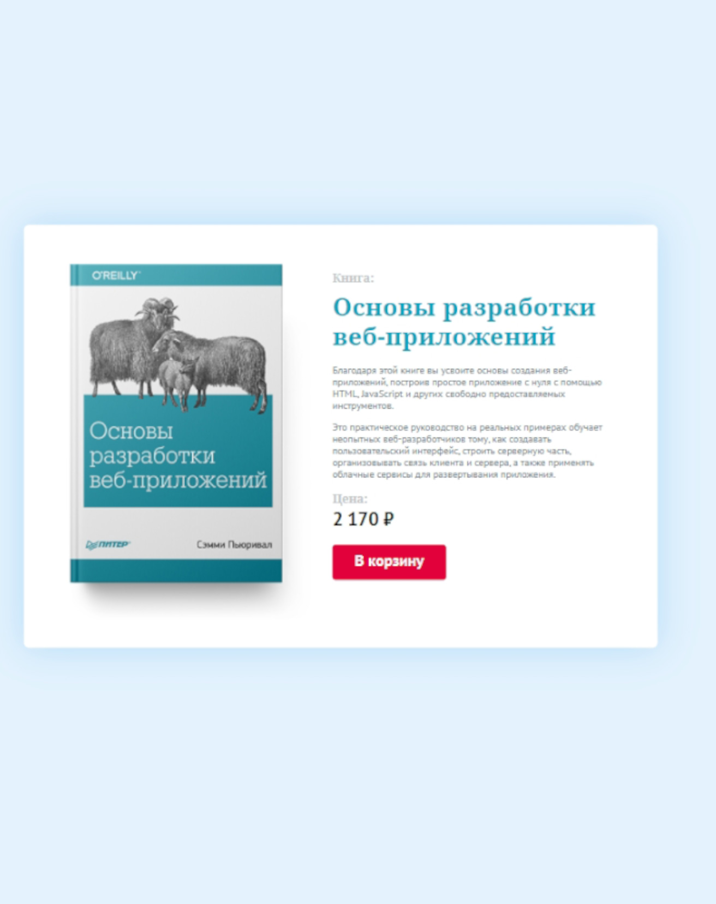

# Карточка товара

## О проекте:

Карточка товара. Я ее сверстал во время обучения на онлайн-курсах по верстке сайтов от [Webcademy.ru](https://webcademy.ru/).

* Срок выполнения: 1 день
* Количество страниц: 1
* Демо онлайн: [book-card-by-valerian.netlify.app](https://book-card-by-valerian.netlify.app/)
* Код на Github: [github.com/Anatoluch/book-product-card](https://github.com/Anatoluch/book-product-card)

## Технологии:

HTML5, CSS3.

## Особенности:

Pixel Perfect верстка по PSD макету.

___

_Если Вам нужен специалист по верстке сайтов - обращайтесь! Я с удовольствием помогу!_
